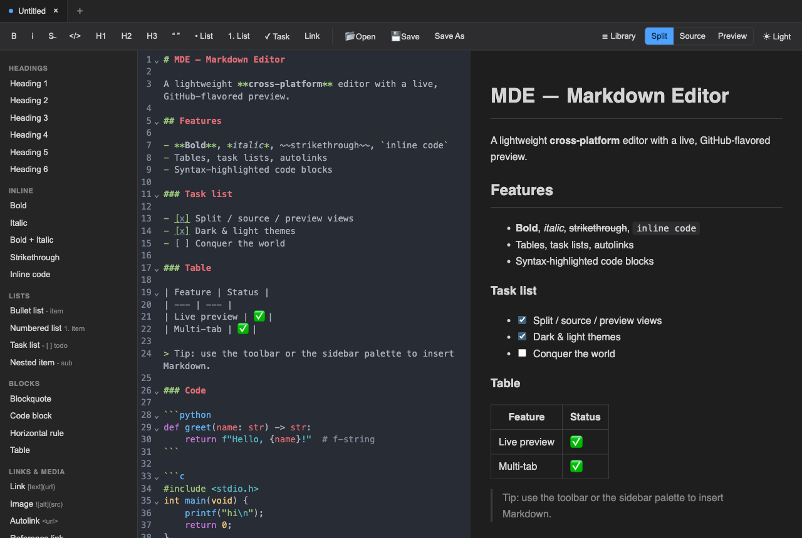
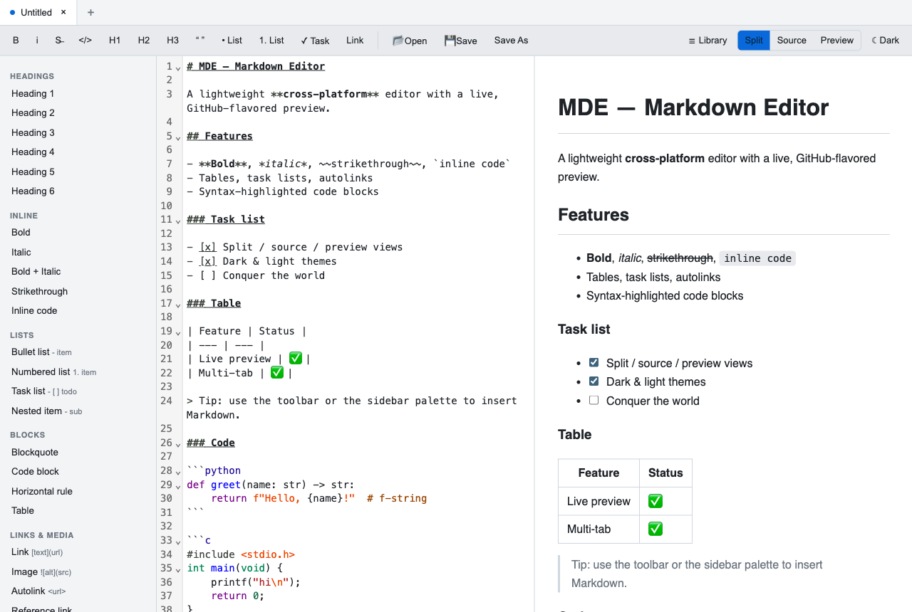
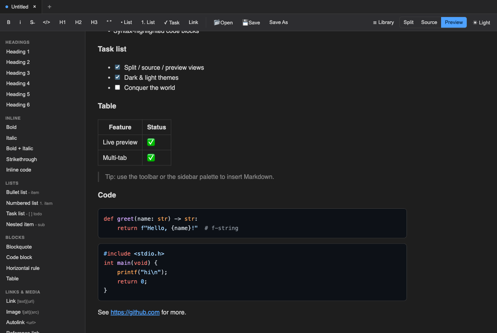
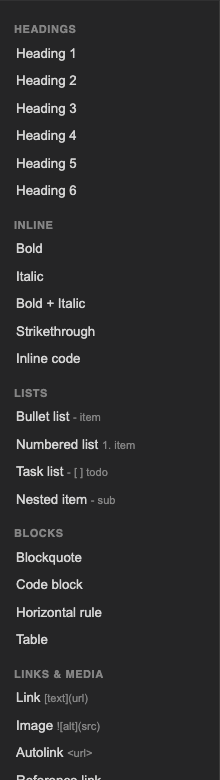

# MDE

**MDE** (Markdown Editor) — a lightweight cross-platform (macOS / Windows / Linux)
Markdown viewer & editor built with **Tauri 2** (Rust) + **TypeScript**.

## Screenshots

Split view (source + live preview), dark and light themes:





Preview with GitHub-flavored rendering and syntax-highlighted code blocks:



The tag-library palette — one-click insertion of every Markdown construct:



## Features

- **Source + Preview** with three view modes: split (synced scroll), source-only,
  preview-only — toggle in the toolbar or with `Cmd/Ctrl+1/2/3`.
- **GitHub-Flavored Markdown**: tables, task lists, strikethrough, autolinks,
  syntax-highlighted fenced code. Preview is sanitized (no script execution).
- **Tag library**: a formatting toolbar plus a browsable sidebar palette covering
  every GFM construct — inserts a snippet at the cursor or wraps the selection.
- **Multi-tab** editing with per-tab unsaved-change indicators and a quit guard.
- **File operations**: New / Open / Save / Save As via native dialogs.

## Prerequisites

- [Node.js](https://nodejs.org) 18+ and npm
- [Rust](https://rustup.rs) toolchain (stable)
- Linux only: `libwebkit2gtk-4.1-dev`, `libgtk-3-dev`, `libayatana-appindicator3-dev`,
  `librsvg2-dev`, `build-essential` (see the Tauri Linux prerequisites docs).

## Develop

```bash
npm install
npm run tauri dev      # launches the desktop app with live reload
```

## Test

```bash
npm test               # vitest: markdown rendering + tab-state logic
```

## Build installers

```bash
npm run tauri build
```

Produces a native bundle for the current OS in
`src-tauri/target/release/bundle/`:

| OS      | Artifact                |
| ------- | ----------------------- |
| macOS   | `.app` and `.dmg`       |
| Windows | `.msi` (and `.exe`)     |
| Linux   | `.AppImage` and `.deb`  |

Build on each target OS to produce that platform's installer.

> **macOS note:** Tauri's default `.dmg` step runs an AppleScript that
> automates Finder to lay out the disk-image window, which fails in headless
> or CI sessions (the `.app` itself builds fine). To produce a DMG without
> Finder scripting:
>
> ```bash
> hdiutil create -volname "Markdown Editor" \
>   -srcfolder "src-tauri/target/release/bundle/macos/Markdown Editor.app" \
>   -ov -format UDZO \
>   "src-tauri/target/release/bundle/dmg/Markdown Editor_0.1.0_aarch64.dmg"
> ```
>
> Running `npm run tauri build` in a normal desktop session produces the
> styled DMG directly.

## Keyboard shortcuts

| Action            | Shortcut            |
| ----------------- | ------------------- |
| New / Open        | `Cmd/Ctrl + N / O`  |
| Save / Save As    | `Cmd/Ctrl + S / ⇧S` |
| Close tab         | `Cmd/Ctrl + W`      |
| Source / Split / Preview | `Cmd/Ctrl + 1 / 2 / 3` |

## Project layout

```
src/            Frontend (TypeScript)
  editor.ts     CodeMirror 6 wrapper + snippet insertion
  preview.ts    markdown-it → highlight.js → DOMPurify
  tabs.ts       Tab/document model
  library.ts    Toolbar + palette definitions
  main.ts       Wiring: UI, file ops, shortcuts, guards
src-tauri/      Rust backend (file read/write commands, window)
tests/          Vitest unit tests
```
